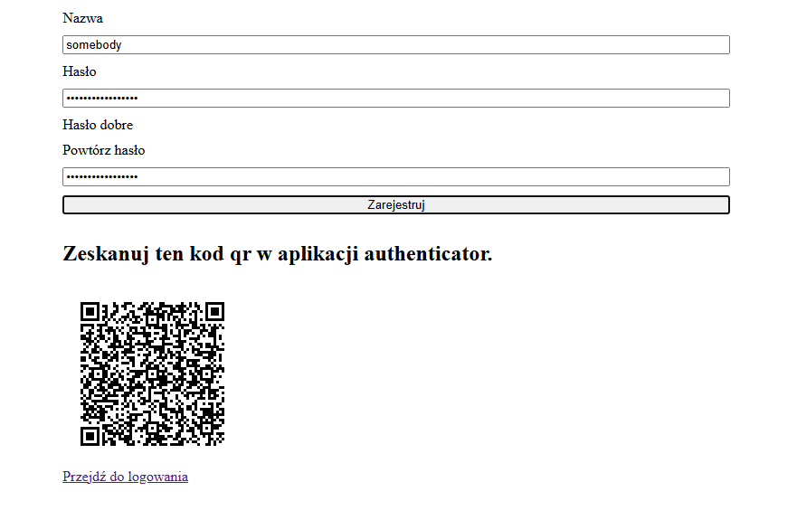
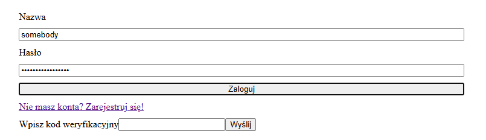
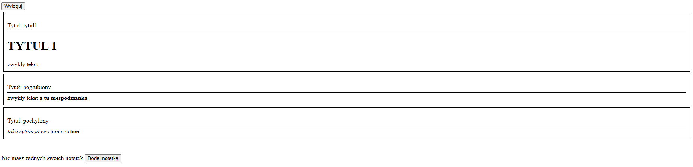
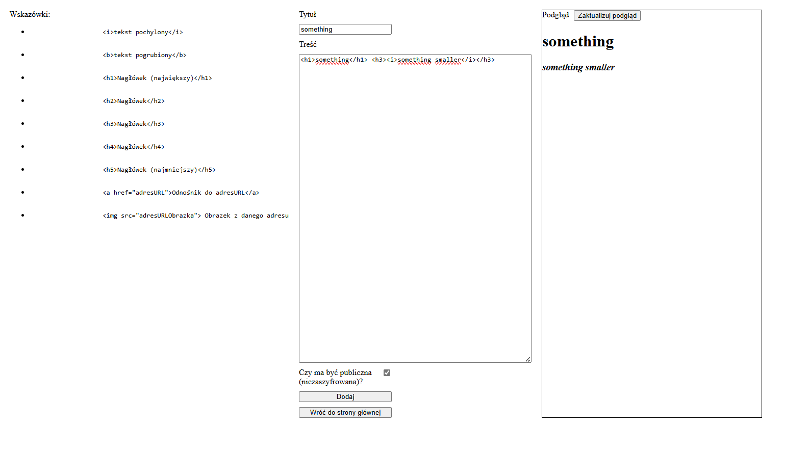
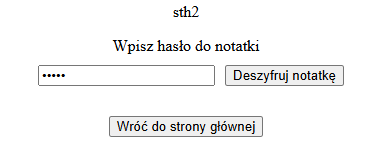

# ODAS---Project

It is a project for one of college classes. The topic is to make application for writing notes and saving it in a secured backend. The whole project is about security, and that's why backend part is the most important. 

## Table of Contents
1. [Technologies](#Technologies)
2. [Features](#Features)
3. [Backend](#Backend)
4. [Frontend](#Frontend)

## Technologies

- Angular,
- Typescript,
- Java,
- Spring,
- JWT,
- Docker,
- Google Authenticator,
- HTML,
- SCSS.
 

## Features

- Writing notes with ability to add some basic styling, such as: 
  - bold/italic, 
  - headers with 1-5 levels, 
  - links, 
  - image from url
- Saving encrypted notes or in plain text (user decides)
- Registration
- Two-factor login
- Sharing notes to other users (user decides whether to set note to public or not)
- Authentication module consists of:
  - Input data validation
  - Delays and login trial limit
  - Limited information about errors
  - Save ways of password storage
  - Password strength counting
  - Data access control
- Whole app is dockerized
 

## Backend

 
<ul>
  <li>Backend application uses PostgreSQL to store data.</li>
  <li>Every endpoint is protected with JWT.</li>
  <li>Two-factor authentication is implemented.</li>
  <li>Password is encrypted before putting it in the database.</li> 
  <li>To encrypt data AES algorithm was used.</li>
  <li>Login attempts are counted and the access is blocked for some time after a few incorrect trials.</li>
  <li>All notes are sanitized before saving into database.</li>
</ul>
 

## Frontend

  
<b>Click to see frontend part</b>

   
  Because the project was mainly about security, the UI is a bit ascetic (although completely functional).

  ### Registration
  For registration you need to write your username and password. Password needs to be at least 8 characters long, contain a number, special sign, big and small letter. Username has to be at leat 5 characters long. You also need Google Authenticator app to scan the QR code for two-factor authentication.

  

  ### Login
  To log in you need to write the same data as for registration. If the data is correct, you will be able to enter the code from Google Authenticator to finish authentication.

  

  ### Main page
  The home page is very simple and displays all public and user notes. You can click the button to log out or to add new note. 

  

  ### Adding new note
  To add new note you have to write a title and some content (content is optional). On the left there are some tips how to add styling to the text, and on the rigth you can check how your note will look after saving (you have to click the button to refresh the preview). You can also choose if you want the note to be public or private (if private you have to write some password) 

  

  After adding a note you will see in the home page your notes. If they are private, only the title will be visible and you will have to decrypt it with the password that you assigned to that note to see the content.

  

 

## Running docker 

If you want to try it out, you have to use `docker-compose up --build` command. After some time, everything should be working. Then, you have to navigate to `https://localhost/`.
